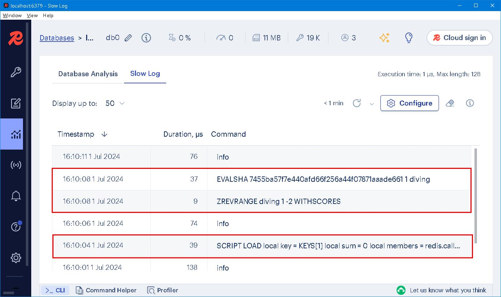

### ADT
Unfortunately, it is very difficult for a designer to select in advance all the abstractions which the users of his language might need. If a language is to be used at all, it is likely to be used to solve problems which its designer did not envision, and for which the abstractions embedded in the language are not sufficient. 

#### I. [The Meaning of Abstraction](https://dl.acm.org/doi/pdf/10.1145/800233.807045), TL;DR 
What we desire from an abstraction is a mechanism which permits the expression of relevant details and the suppression of irrelevant details. In the case of programming, the use which my be made of an abstraction is relevant; the way in which the abstraction is implemented is irrelevant. If we consider conventional programming languages, we discover that they offer a powerful aid to abstraction: the function or procedure. 

When a programmer makes use of a procedure, he is (or should be) concerned
only with what it does -- what function it provides for him. He is not concerned with the algorithm executed by the procedure. In addition, procedures provide a means of decomposing a problem -- performing part of the programming task inside a procedure, and another part in the program which calls the procedure. Thus, the existence of procedures goes quite far toward capturing the meaning of abstraction. 

Unfortunately, procedures alone do not provide a sufficiently rich vocabulary of abstractions. The abstract data objects and control structures of the abstract machine mentioned above are not accurately represented by independent procedures. Because we are considering abstraction in the context of structured
prograrmning, we will omit discussion of control abstractions.

This leads us to the concept of abstract data type which is central to the design of the language. An *abstract data type* defines a class of abstract objects which is completely characterized by the operations available on those objects. This means that an abstract data type can be defined by defining the characterizing operations for that type.

We believe that the above concept captures the fundamental properties of abstract objects. When a programmer makes use of an abstract data object, he is concerned only with the behavior which that object exhibits but not with any details of how that behavior is achieved by means of an implementation. The behavior of an object is captured by the set of characterizing operations. Implementation information, such as how the object is represented in storage, is only needed when defining how the characterizing operations are to be implemented. The user of the object is not required to know or supply this information.

Abstract types are intended to be very much like the built-ln types provided by a programming language. The user of a built-in type, such as *integer* or *integer array*, is only concerned with creating objects of that type and then performing operations on them. He is not (usually) concerned with how the data objects are represented, and he views the operations on the objects as indivisible and atomic when in fact several machine instructions may be required to perform them. In addition, he is not (in general) permitted to decompose the objects. Consider, for example, the built-in type *integer*. A programmer wants to declare objects of type *integer* and to perform the usual arithmetic operations on them. He is usually not interested in an integer object as a bit string, and cannot make use of the format of the bits within a computer word. Also, he would like the language to protect him from foolish misuses of types (e.g., adding an integer to a character) either by treating such a thing as an error (strong typing), or by some sort of automatic type conversion.

In the case of a built-in data type, the programmer is making use of a concept or abstraction which is realized at a lower level of detail -- the prograrmning language itself and its compiler. Similarly, an abstract data type is used at one level and realized at a lower level, but the lower level does not come into existence automatically by being part of the language, instead, an abstract data type is realized by writing a special kind of program, called an *operation cluster*, or cluster for short, which defines the type in terms of the operations which can be performed on it. The language facilitates this activity by allowing the use of an abstract data type without requiring its on-the-spot definition. The language processor supports abstract data types by building links between the use of a type and its definition (which may be provided either earlier or later),and by enforcing the view of a data type as equivalent to a set of operations by a very strong form of data typing. 

We observe that a consequence of the concept of abstract data types is that most of the abstract operations in a program will belong to the sets of operations characterizing abstract types. We will use the term *functional abstraction* to denote those abstract operations which do not belong to any characterizing set. A functional abstraction will be implemented as a composition of the characterizing operations of one or more data types, and will be supported in the usual way by a procedure. A sine routine might be an example of such a functional abstraction. The implementation of the sine routine could be a Taylor series expansion expressed in terms of characterizing operations of the type *real*.


#### II. Monologue 
If it is required to process a sequence of numbers without further ado? The most secure option is to choose *array* as data structure, because it's efficient and simple to use. With more details exposed. we bend and twist the data structure so as to fit and solve the problem. Typically, the *nth*-element of an zero-based array is calculated according to the formula: 
```
base_address + (index + element_size) 
```

See! Efficient and simple random access are obtained... Array, per se, has its downside, ie. memory chunk has to be allocated consecutively and may incur wastage of space. In addition, every element is bounded to a specific index (position in memory) which makes it non-trivial task to move or insert element in between, searching and sorting are also time-consuming, let alone removing duplicated elements and finding the same elements among arrays. Nevertheless, array is the most widely used data structure in modern programming languages. What if more details is deduced in the first place...? May be we could opt a better data structure. 

> Operations shape the data structure. 

List, Stack, Queue, Set, Collection and Hash are common abstract data types. Each of them bears peculiar properties and thus has pros and cons. When talking about ADT, we care more about properties rather than implementation details. 

In a similar way, if it is told to process a number of records? The most obvious choice is table in relational database, because we can not forsee future requirement. Storing everything in tables seems the most flexible solution. 

> A solution not necessarily be a right solution. 

Requirement evolves and so does data structure, database schemas undergo constant changes are evidence of system evolution. 

---

Customers are treated in *first come, first serve* manner, the straightforward data structure is queue. A seasoned developer would quickly setup a schema in MYSQL: 
```
CREATE TABLE queue (
     id MEDIUMINT NOT NULL AUTO_INCREMENT,
     name CHAR(30) NOT NULL,
     PRIMARY KEY (id)
);

INSERT INTO queue (name) VALUES
    ('John'),('Peter'),('David'), ('Mary'),('Lancy'),('Joan');

SELECT * FROM queue; 
```

By employing `AUTO_INCREMENT` and `PRIMARY KEY`, one can effectively turn a table into a queue. New comers are inserted at the bottom. To serve a customer, one needs to retrieve and remove the topmost record. 
```
SELECT id, name FROM queue LIMIT 1 OFFSET 0;
DELETE FROM queue where id=:id
```

A *dead easy* solution... But there is a catch! Mutual exclusive has to be ensured so that a single customer may not be served by two clerks, or some error handling mechanism has to be devised. 

In Redis, a natural solution is to use LIST:
```
RPUSH queue 'John' 'Peter' 'David' 'Mary' 'Lancy' 'Joan'

LRANGE queue 0 -1
```

New comers are `RPUSH` to the right. To serve a customer, one need `LPOP`.
```
LPOP queue
```

The objective of this example is not to compare pros and cons between SQL and NoSQL but to emphasize *semantics* difference between the two. 

> The higher abstraction level, the more precise semantics of domain. 

Later on, you get furious upon hearing order to refine the queue into [priority queue](https://www.geeksforgeeks.org/priority-queue-set-1-introduction/). That means you have to design and implement everything from ground up... Behold! Redis has a dedicated data structure called `Sorted Set` designed specifically for this purpose. 

> RDBMS is a good thing but is not good enough for everything. 

On resource distribution system, each applicant is associated with a *score* calculated by a formula, resource are then distributed from the highest score down till all resource consumed. 
```
ZADD resource_queue 33.5 'John' 47.8 'Peter' 22.3 'David' 50.1 'Mary' 18.2 'Lancy' 42 'Joan'

ZREVRANGE resource_queue 0 -1 WITHSCORES
1) "Mary"
2) "50.1"
3) "Peter"
4) "47.8"
5) "Joan"
6) "42"
7) "John"
8) "33.5"
9) "David"
10) "22.3"
11) "Lancy"
12) "18.2"
```

Data can be added in any order at any time. The order will be updated automatically. 

> A hybrid system of relational and non-relational components compensates intrinsic shortcoming of the other. 

---

> In Olympic water diving competitions, there are typically seven judges who give scores for each dive. These judges assess the execution and quality of the dive based on various criteria, such as takeoff, flight, and entry into the water. Each judge assigns a score to the dive independently, usually ranging from 0 to 10 or in half-point increments.

> To calculate the final score for a dive, the highest and lowest scores given by the judges are discarded, and the remaining scores are summed. The sum is then multiplied by the degree of difficulty multiplier to determine the total score for the dive.

To set up a table and populate with seven records. 
```
CREATE TABLE diving (
     id MEDIUMINT NOT NULL AUTO_INCREMENT,     
     judge CHAR(30) NOT NULL,
     score FLOAT NOT NULL, 
     PRIMARY KEY (id)
);

CREATE UNIQUE INDEX idx_diving_score ON diving (score DESC, judge, id);

INSERT INTO diving (judge, score) VALUES
    ('John', 7.5),('Peter', 6.7),('David', 5.5), ('Mary', 8.9),('Lancy', 7.8),('Joan', 6.3),('Dave', 5.5);

SELECT * FROM diving ORDER BY score DESC, judge, id; 
```

A twist in SQL would yield the result: 
```
SELECT ROUND(SUM(score),1) FROM diving
WHERE id <> (SELECT id FROM diving 
             WHERE score = (SELECT MAX(score) FROM diving)
             LIMIT 1 OFFSET 0 ) AND 
      id <> (SELECT id FROM diving 
             WHERE score = (SELECT MIN(score) FROM diving)
             LIMIT 1 OFFSET 0 ); 

33.8
```

Easy-peasy, right? Well, in Redis: 
```
ZADD diving 7.5 'John' 6.7 'Peter' 5.5 'David' 8.9 'Mary' 7.8 'Lancy' 6.3 'Joan' 5.5 'Dave'

ZREVRANGE diving 0 -1 WITHSCORES
1) "Mary"
2) "8.9"
3) "Lancy"
4) "7.8"
5) "John"
6) "7.5"
7) "Peter"
8) "6.7"
9) "Joan"
10) "6.3"
11) "David"
12) "5.5"
13) "Dave"
14) "5.5"
```

But there's no direct way to aggregate the score of a sorted set. This is where [Lua](https://www.lua.org/manual/5.4/) script comes into play: 
```
SCRIPT LOAD "
local key = KEYS[1]
local sum = 0
local members = redis.call('ZREVRANGE', key,  1, -2, 'WITHSCORES')

for i = 1, #members, 2 do
    sum = sum + tonumber(members[i + 1])
end
return tostring(sum) "

"7455ba57f7e440afd66f256a44f07871aaade661"
```
```
EVALSHA "7455ba57f7e440afd66f256a44f07871aaade661" 1 "diving"

"33.8"
```

As you can see: What appears difficult in SQL is easy in Redis; What appears difficult in Redis is easy in SQL. 

> Implementation differs, way of thinking remains... 

As for Time complexity: if to search a node in b-tree is O(N Log(N)), then search  for MAX and MIN plus a full table scan to sum up all scores is the total time in SQL. 


Which is 0.0008 seconds, which is 0.8 ms.

O(log(N)+M) with N being the number of elements in the sorted set and M the number of elements returned. Plus a traverse of M elements to sum up all scores is the total time in Redis. 



Which is 0.000037 seconds, which is 0.037 ms, which is 37 µs. 37 µs for EVALSHA within which 9 µs for ZREVRANGE. A one-time charge 39 µs for SCRIPT LOAD. 


#### III. Bibliography
1. [Programming with abstract data types, Barbara Liskov and Stephen Zilles, 1974](https://dl.acm.org/doi/pdf/10.1145/800233.807045)
2. [Using AUTO_INCREMENT](https://dev.mysql.com/doc/refman/8.4/en/example-auto-increment.html)
3. [Redis sorted sets](https://redis.io/docs/latest/develop/data-types/sorted-sets/)
4. [Top 5 Redis Use Cases](https://www.youtube.com/watch?v=a4yX7RUgTxI)


### EOF (2024/06/28)