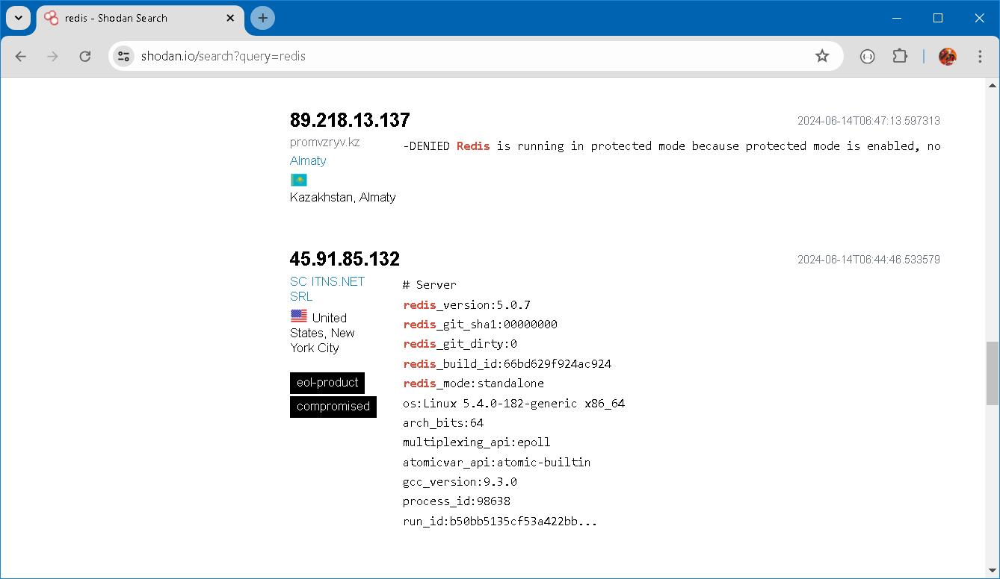
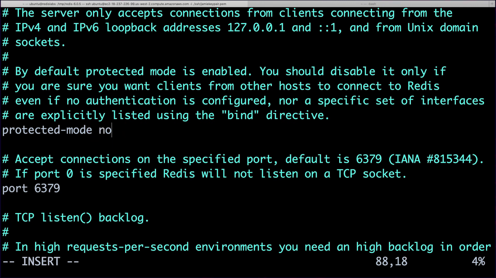
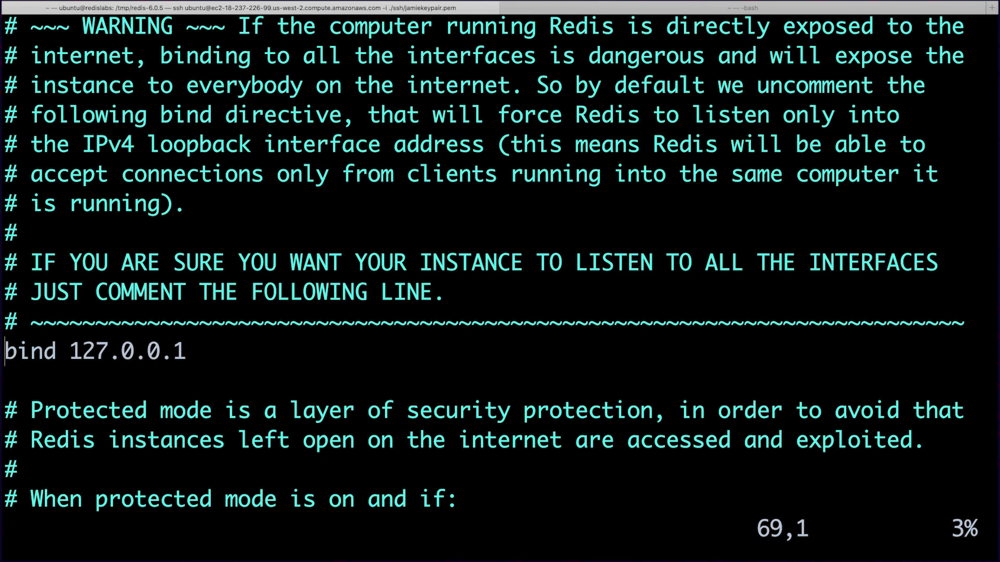
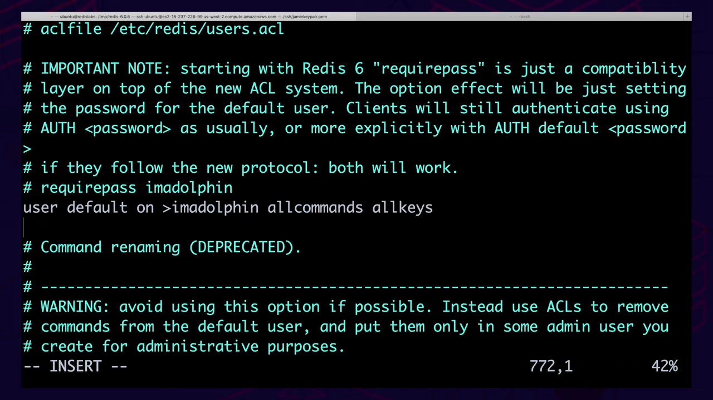
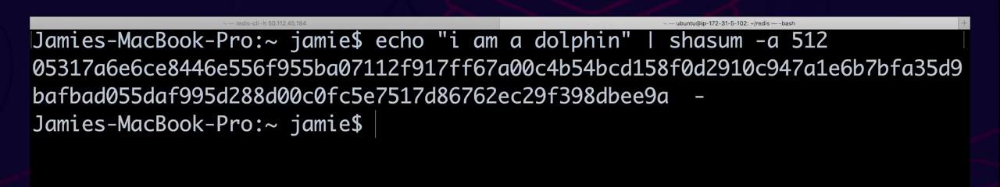

### On Security 


### Prologue 
This article is created from transscript of [RU330](https://redis.io/university/courses/ru330/) verbatim, not because of my laziness. But for the great significance and unstirrable value in the aforementioned narrative of the course. Nevertheless links and addenda will be appended whenever it is appropriate.


### I. Redis Horror Story #1
All seasoned security professionals have their fair share of security horror stories. Some of those stories involve Redis. To show you just what's possible in the real world, I'm going to share a different Redis security horror story at the beginning of each week. This week's story is [Redis Wannamine](https://www.imperva.com/blog/archive/new-research-shows-75-of-open-redis-servers-infected/).

Redis Wannamine is the name for a Redis exploit that used a combination of vulnerabilities to run crypto mining software on Redis servers. Attackers first scanned the internet, looking for applications using [Apache Struts](https://struts.apache.org/). The attack then exploited a known vulnerability in Apache Struts to run commands on the server to target Redis. The attack then used Redis to create a cron job and install a *crypto miner* in a Redis data file known as an RDB file.


> A crypto miner, also known as a cryptocurrency miner or crypto-mining software, is a program or software application that utilizes computational power to solve complex mathematical problems, validate transactions, and secure a blockchain network in exchange for rewards in the form of cryptocurrencies.

Imagine the poor administrator who set this up. They went through a ton of trouble to ensure that their Redis was closed to the internet, and they may have even ensured Redis was only accessible on the local host. Still, the attackers were able to hijack the Redis server because of other vulnerabilities in the system. Talk about feeling like you don't control your own destiny. But what could have prevented this attack? Well, outside of securing external systems, *setting a strong password on Redis or changing the default port could have prevented this exploit entirely*.

This administrator probably thought they'd done everything right, so they decided they could treat themselves and forget the password to Redis. Unfortunately, that's not how it works in the world of security. As a result, that administrator ended up enriching the attackers. At the time, one [Monero](https://en.wikipedia.org/wiki/Monero) coin was worth between $80 and $100. 

Bottom line-- your CPU is worth something to attackers. It's not always the data they're after. And it's not enough, in all cases, to secure Redis from the outside. It's usually best to secure it from the inside as well.

> Always require a Redis strong password. Vulnerability may lurk where you least expect them! 


### II. The CIA Triad
The CIA triad describes the three most basic goals of information security: Confidentiality, Integrity, and Availability.


#### Confidentiality
Confidentiality is the property, that information is not made available or disclosed to unauthorized individuals, entities, or processes.

Suppose you send a letter in the mail to your sibling on their birthday. You want to ensure that the letter is only accessible to your sibling. To help ensure the confidentiality of the letter, you seal it in an envelope.

The letter is confidential because it's sealed in an envelope so that no one can see its contents. This is certainly more secure than a postcard, where anyone who handles it can read it.

#### Integrity
Integrity is the assurance that a message is not modified in transit.

A common technique for ensuring the integrity of a letter is signing the sealed flap and then comparing the signature on the flap to a known signature. A known signature over the flap of an envelope tells us two things: first, that the contents of the letter haven't been modified, and second, that the letter was sealed by a known sender.

#### Availability
Availability, which is the final concept in the CIA triad, is the property that the services you need are available for use when you need them.

For example, when you send a letter, you're relying on an operational postal service. You're making the assumptions that:

1. A mail carrier will pick up your letter.
2. A sorting facility will reliably route your letter to another post office.
3. A mail carrier at the other post office will deliver your letter to its intended recipient.

While securing a letter and securing a Redis deployment differ wildly in practice, you can refer to the CIA triad in both cases to plan your security strategy.

As security engineers or administrators, it's our responsibility to ensure that we always take confidentiality, integrity, and availability into consideration when we're designing secure systems. We'll frequently revisit these concepts throughout the course, so make sure you understand them before moving on.


### III. Risk Assessment
Risks are everywhere. But it's rarely practical to secure against every conceivable risk. What this means is that security is not always about securing "all the things."

Rather, security is about making informed risk management decisions. A good security plan makes clear what risks it's prioritizing.

Accepting risk is okay; which risks you choose to accept are entirely dependent on your unique situation. This is the art of risk assessment. The risk assessment process follows the steps outlined in the diagram below.


#### Establish Context
The first and most critical part of the risk assessment process is establishing context. What do we mean by context? Let's take an example.

Suppose you're a hospital processing health records and making them available online. Your security decisions will be completely different from those of a website that generates memes.

> A meme is an idea, behavior, or style that spreads rapidly within a culture. In the context of the internet, a meme refers to a humorous or entertaining piece of content, typically in the form of an image, video, or text, that spreads rapidly across various online platforms.

So you consider the context of a security risk by measuring the impact of an identified security issue and the likelihood of a risk being exploited.

We can all probably agree that the impact of a hospital data breach is much more serious that a meme generating website breach.

#### Assess Risk
Once you establish context, you perform a risk assessment. To cite the Wikipedia definition, a [risk assessment](https://en.wikipedia.org/wiki/Risk_assessment) is "an assessment of the possible mishaps, their likelihood and consequences and your tolerances for such events."

First you must identify the mishaps.

For this example, let's suppose our hospital has discovered that unauthorized users can access other users' health records using a public API. This may occur if the API doesn’t have access controls built into it. would allow unauthorized users to access other users' data.

Our meme website may have found that all employees have full database access, allowing anyone to drop all the tables. This might occur if the database is protected by a corporate network. In this case, an administrator might not bother to enable authentication.

So, here we've established a couple of risks for our hospital and meme generator website.

#### Analyze the Situation
Once we understand the possible risks, we need to analyze them. Analysis is an assessment of the impact the identified risk would have on a business if the risk were exploited.

In our healthcare example, a data breach may be reportable to the government. Such a breach might also make the news, damaging the hospital's reputation and opening it to litigation by the patients whose data has been exposed.

In our meme generator example, a dropped database might prevent users from visiting the site, causing anything from minor annoyance to an exodus of users to a competing website.

#### Evaluate the Risk
Once we've analyzed the potential impact of each risk, the next step is to evaluate the cost of the impact if a risk materializes.

Suppose we're storing 5000 records in our healthcare application. According to a research study by IBM [("The 2019 Cost of a Data Breach")](https://securityintelligence.com/posts/whats-new-in-the-2019-cost-of-a-data-breach-report/), the average cost of a breached healthcare record is $429. This means that a compromise of all records could cost us over 2 million dollars.

Now, we believe that the probability of someone exploiting our application is 25%. We can use the technique of mathematical expectation to estimate that the cost of failing to mitigate this risk is about half a million dollars. This does not include potential damage to our reputation, which is harder to define.

Now let's apply the same thinking to our meme generator.

The cost of a dropped database for our meme website is significantly less than half a million dollars. The meme website makes a few cents in advertising revenue every time a user visits the site.

What we don’t know with 100% certainty is how many times a user will come back and at what point issues will cause our user to abandon our site altogether. Sometimes risks are hard to quantify, so we have to take our best guess.

#### Risk Decision
Once we’ve evaluated each risk, it's time to make a decision about what we want to do about the risk. We need to base this decision on an analysis of cost to mitigate it compared to the potential cost of the risk.

Risks can either be accepted, mitigated, transfered or avoided.

1. **Accepting** means the organization will do nothing.
2. **Mitigating** means that the organization will take action to reduce the likelihood of the risk.
3. **Transferring** means moving the cost of the risk to a third party, such as an insurance provider.
4. **Avoiding** means disbanding the project or resolving the issue entirely.

The hospital provider will likely choose to mitigate or avoid the risk due to the high cost. The cost of the risk is probably greater than the cost of writing the code to fix the application.

Mitigating the risk may involve putting the public API behind a firewall and adding authentication and access controls.

The meme provider will likely accept or mitigate their issue. The risk to the meme provider is lower because the cost is not high; however, adding authentication to the database is relatively simple. They may choose to mitigate the risk by adding authentication.

No matter what we decide, we'll always want to continue monitoring the decision to see if the risk materializes and decide whether a different action needs to be taken.

#### In Summary
For those of you who aren’t security engineers, know that what we've described above is what occurs in the course of any standard risk assessment.

It's important to remember that no risk management strategy is appropriate for every situation. While the term "secure all the things" is catchy, many have learned the hard way that it's not always the most expedient or most cost-effective approach.

The bottom line is that risk assessments and decisions are business-driven. When deploying and configuring Redis, like any database, you should keep this in mind to ensure that your approach to deploying Redis aligns with your organization's risk management policies.


### IV. Defense in Depth
A common quote among security professionals is, "Attackers only have to be right once, but we have to be right every time." You may have heard this, and this hyper-paranoid position may make you overly fearful.

This assertion, it turns out, is an oversimplification, and it's absolutely incorrect in any reasonably modern security architecture.

*Defense-in-Depth Architecture is the concept of information security that takes a layered approach to data protection. Database security is one of the last lines of defense in this architecture.*

Data security is typically deployed in layers, like an onion. Each layer represents a barrier for an attacker and an opportunity for you to prevent that attacker from getting to your data.

The first layer is the firewall. You want to ensure that no one can directly access your database or the servers your database is hosted on from the outside world.

The second layer is frequently your application-level defenses. A consistent patch management process for your application dependencies and secure development practices can go a long way in ensuring that apps can’t be used to get to your database. In our RedisWannamine example, a vulnerability in ApacheStruts was used to get direct access to Redis. Your application and operating system should be tested and regularly updated to reduce the likelihood of known exploits being used against your systems.

Hardening your database server is the next layer of defense.

There are a few ways of going about hardening a database.

First, you want to ensure that you're running the most recent version of your database to prevent attackers from exploiting known vulnerabilities. For instance, with Redis, there are several exploits affecting old versions of the software.

Next, you'll want to employ database authentication and authorization. For a long time, Redis has supported a basic authentication model in which a single password grants complete access to the database. But this represents a bare minimum.

In addition, you'll want fine-grained authorization controls. Later in this course, we'll discuss access control lists, which became available in Redis 6, and role-based access control, which is a feature of Redis Enterprise 6.

Finally, you should consider the various types of database encryption, such as client side encryption, disk encryption and transport layer security. These can help prevent attackers from obtaining unauthorized access to your data.

Your final layers of defense are detective controls and *Data Loss Prevention* controls, better known as DLP. If an attacker is moving throughout your network, you may be able to catch them.

Standing up infrastructure to detect attackers in your environment may alert you to this to help stop the attacker in their tracks.

In the event that an attacker gets access to your data, DLP controls may prevent them from removing that data.

What's important to remember is that the database itself does not have the sole responsibility of ensuring the safety of your data. A defense-in-depth security architecture ensures that an attacker will have to cross multiple layers to get to your database.

If one of these layers fails, there is another that can help protect you.


### V. [Installing Redis Securely](https://youtu.be/Qj5shmkyUDc)
In this unit, we'll look at some Redis installation best practices. I want to start with my top three recommendations for securely installing Redis on a server.

First, always run Redis as a dedicated non-privileged user. In other words, don't run Redis as a sudoer or as root. Second, always restrict permissions on your Redis installation path. Third, always restrict Redis log and configuration files. 


In other words, ensure the Redis log and config are only accessible by a dedicated non-privileged Redis user plus a small group of trusted admin. This is all basic operating system-level configuration. This OS-level config limits the risk of unauthorized access to Redis. Let's review an example configuration in action. And by the way, if you want to run this on your own, we've provided a Dockerfile in the course [GitHub repo](https://github.com/redislabs-training/ru330). 

Here I am in the terminal. I'm going to show you how I'd set up a secure Redis installation for the first time and what I'm thinking along the way.
```
sudo apt update -y

sudo apt install build-essential tcl -y 

sudo apt install tcl-tls libssl-dev -y 

sudo adduser --system --group --no-create-home redis 

sudo mkdir /var/lib/redis 

sudo chown redis:redis /var/lib/redis 

sudo chmod 770 /var/lib/redis 

sudo mkdir /var/log/redis 

sudo touch /var/log/redis/redis.log 

sudo chmod 660 /var/log/redis/

sudo chmod 640 /var/log/redis/redis.log
```

We're using Ubuntu for this example. First, we'll update the operating system-level dependencies and install the dependencies required to run Redis securely. We'll also install `tcl-tls` and `libssl-dev`. These are the OpenSSL development libraries that TLS requires. 

We don't want Redis to run as a root user. Instead, we're going to install Redis as a dedicated non-privileged user and group. Here, I'm creating a user and group called `Redis` for this purpose. In some distributions, this user will be pre-created by previous package installations. 

Now that we have a user, let's create a working directory for Redis. This is where we will install Redis later.Next, I'll chown to ensure that the Redis user owns its directory. Finally, I want to restrict this directory's permissions so that only Redis can access it. Now I will create a file and directory for the Redis logs.

First, I'll create the directory `/var/log/redis`. Next, I'll pre-create the Redis log file so that it has the appropriate permissions. We modify these permissions to ensure that only the Redis user, the root user, or a user added to the Redis group can access these log files.


Next, we'll install Redis. You'll want the latest version of Redis from the [redis.io downloads](https://redis.io/downloads/) website.

---

Scroll down to the **Redis Community Edition & Stack** section and you will see **Redis Stack downloads** for various platforms. 


---
You should always check the Redis website to ensure you're running the latest version of Redis.

```
cd /tmp

wget http://download.redis.io/release/redis-6.0.5.tar.gz 

sha256sum redis-6.0.5.tar.gz

tar -xzvf redis-6.0.5.tar.gz

cd ./redis-6.0.5

sudo make BUILD_TLS=yes install 

sudo mkdir /etc/redis

sudo cp redis.conf /etc/redis

sudo chown -R redis:redis /etc/redis 

sudo chmod 640 /etc/redis/redis.conf 
```

First, let's download the package. Before we do anything else, we need to verify the integrity of the download. This will give us a pretty good assurance that the code we've downloaded is official. The Redis GitHub page contains an integrity check for each downloadable tarball file. To verify the integrity of the file, we'll want to check its SHA-256 hash using the SHA-256 hash sum utility. We'll compare this output with the output of the Redis
repository.

We see here that both files start with 4 and 2 and end with 596. On further comparison, we know that they are a match, so it's safe to install Redis using this file. Now let's build Redis from source. First, we'll untar the archive we just downloaded. We need to set the `BUILD_TLS` environment variable when we compile so that `TLS` will be available for us. Now, this might take some time. So through the magic of video editing, we'll fast forward through it. Now that Redis is installed, we can set the appropriate permissions for the Redis conf configuration file. Let's create a directory to store the config file. We'll use `/etc/redis`. Now we'll copy over the Redis conf file. And now, we'll change the files, user, and group to Redis. We also need to set the proper user permissions. We don't want just anyone to be able to write to our Redis conf file. With this basic OS configuration out of the way, we can start Redis. 

```
sudo runuser -u redis /usr/local/bin/redis-server /etc/redis/redis.conf & 

sudo apt install redis-tools -y
```


Usually, you'll daemonize Redis in whatever OS-specific way your organization prefers. For our purposes here, it's enough to start Redis as a simple background process using the ampersand. Now we should be able to access Redis via the `redis-cli`. I'll run the ping command, and I get back pong. So I've successfully connected.


There are a ton of ways to install Redis. The way we showed you here might not be right for everyone. What's important here is that we've restricted the files on the operating system and run Redis as a non-privileged user. This approach will allow us to limit the damage that could take place if our server or Redis instance were ever compromised.


### VI. [Basic Redis Security](https://youtu.be/BoZOZhDnxtI)
Now that we've installed Redis securely, it's time to learn about the most basic Redis security settings. In this unit, we'll be discussing firewalling Redis, Redis' protected mode, and the default bind interface in the Redis configuration file. In the next unit, we'll discuss authentication. 

These are the most basic Redis security controls typically used with Redis. I strongly recommend that you run Redis behind a firewall and use authentication at all times in production. If you don't, you'll greatly increase the risk of a data compromise. Let's start with [firewalling](https://en.wikipedia.org/wiki/Firewall_(computing)). 

> In computing, a firewall is a network security system that monitors and controls incoming and outgoing network traffic based on predetermined security rules.

Firewalling is the process of subdividing your network for improved security. Remember Redis Wannamine? This isn't the only attack targeting Redis. Here is an [article](https://www.imperva.com/blog/archive/new-research-shows-75-of-open-redis-servers-infected/) about another crypto mining campaign targeting Redis instances that happened to be open on the public internet. The number one rule for Redis, or any database for that matter, is to never allow a production deployment to be open on the public internet. 


This means setting up a firewall and ensuring that your database is behind it with no exposed Redis ports. You should always deploy your database in a private network and connect to it using private IP addresses. If you're hosting Redis on your favorite public cloud, you typically deploy Redis in a virtual private network, which is better known as a VPC or VNet. If you're hosting Redis on-premises in a data center, you need to make sure that Redis is not hosted inside your demilitarized zone, that is your DMZ, and that you use a firewall to block access to Redis.

This advice might seem obvious, but in reality, there are a lot of folks that still expose their database to the public internet. We can see some of these at [Shodan.io](https://www.shodan.io/), which is basically a search engine for public internet servers. Companies often use Shodan to monitor their networks, but the bad guys can use this tool just as easily. Let's type Redis into the search bar. Here, you can see a list of Redis servers open to the entire internet.


It would be trivial to connect to any of these servers. And yes, we've blurred the IP addresses for their protection. But you can see a full listing of information for each Redis server, everything from the server version to the compiler version. We can also see that some servers have no authentication enabled. If I wanted to hack this server, I've just hit the jackpot. If you scroll down in Shodan a bit, you'll see that other Redis servers don't share this information. That's because they're running in protected mode. 



So what is protected mode? Protected mode helps us prevent new Redis deployments from being exposed to the world or even to your internal network. When Redis starts with the default configuration, it's automatically started in protected mode. In this mode, Redis will only reply to clients located on the same server that Redis is running on. If you connect from a remote host and try to run a command, you'll get an error message as you see here. So you have to disable protected mode to access Redis outside of the local host.So how do you disable protected mode? Typically, through the Redis conf file. You simply have to set protected mode to no here. 



The Redis conf file also comes with a default directive to bind exclusively to the local network interface. This means that Redis will only listen to connections coming to this specific IP address, which is, by default, the local loopback interface. To have Redis listen on all network interfaces, just comment out the bind directive. Or if you want to bind to a specific interface, provide that interface's IP address to the bind directive. 



To review, don't ever expose your Redis server to the public internet. Ensure that you're firewalling and binding to the correct network interface, and be sure to disable protected mode only when you've secured your server with the network and, ideally, after you've enabled authentication. In the next unit, we'll get a basic introduction to authentication in Redis.


### VII. [Basic Authentication](https://youtu.be/B4jxDMxVvYM)
Now, let's talk about basic authentication. Using Redis without authentication is one of the worst Redis deployment practices we see in the wild. To run Redis securely, you really need to enable auth. There are two ways to do this. Prior to Redis 6, there was no concept of users. You simply set a single global password that controlled all access to the Redis server. In the Redis conf file, you can set this global password with the `requirepass` directive. Here, I'm setting the password to imadolphin. 


Now I'll restart Redis with the new config. Now, when I connect to Redis, I can't run any commands until I authenticate with this password. See? Here, I'm trying to run the `info` command, but I get a noauth authentication error. Now I'm going to authenticate by running the `auth` command and providing the configured password. If you're using a version of Redis before Redis 6, then this is your only option for enabling authentication. This `requirepass` directive still works in Redis 6 for backwards compatibility. But if you're running Redis 6 or later, then you should definitely use the `ACL` user directive instead. In Redis 6, there's now a default user called `default`. You need to make sure that this default user has a password since it won't have one to begin with. So I'm going to open up the Redis conf file and comment out the `requirepass` directive. Now, I'm setting the default user's password to imadolphin. I'm also giving this user all permissions to the database. This configuration is now equivalent to what we had with the `requirepass` directive before.



Now I'll restart Redis with this new config. Now, when I log in, I need to authenticate as this default
user before I can do anything. I use the same `auth` command to authenticate, but I also provide the user name, as you see here. Now I can run commands.
```
AUTH default imadolphin

INFO
```

A couple notes on passwords-- 
- first, you probably don't want to store plaintext passwords in the Redis conf file. We'll see how to store hash passwords here later in the course. 
- Second, you want to make sure that passwords can't be cracked through brute force. 

A password like imadolphin is probably too short for production. I recommend that you use a long, 128-character password, which would be practically impossible for an attacker to crack. How can you create such a long password? You can do this with Linux's shasum command. Here, I'm piping the password, imadolphin, to the shasum utility that comes with OS X. By specifying a 512-bit hash, I can create a password that's exactly 128 characters long. 



So what I've just described is the most basic form of Redis authentication. In this case, there's only a single user and password for all people and services accessing Redis. It's a much better practice to use finer-grained per-user access control. Redis supports these with ACLs or Access Control Lists, and we'll discuss these next week.


### VIII. [Securing Redis Client Code](https://youtu.be/JquRVRKYTxk)
In this unit, we're going to cover common techniques for securing the client-side code that interacts with Redis. But first, some good news. One of the most well-known security exploits in the database world is [SQL injection](https://en.wikipedia.org/wiki/SQL_injection). Because Redis doesn't use a query language, malicious injection isn't a real concern with Redis, so don't worry about SQL injection.

What you do need to worry about is validating any input that's used to run commands against Redis. This is relevant when constructing Redis key names and running Lua scripts.

Let's first look at key names. It's quite common in Redis to dynamically generate key names. Usually, you have a key naming pattern where you separate a different part of a key with a colon. For instance, if I'm storing user sessions in Redis, my keys might look like this. I'd start with a session to indicate the type of key, plus a colon, plus user to indicate the type of session, plus an ID representing that user. 


If I had separate session keys for, say, an API, those keys might look like this. 


Now let's look at a real-world example where unvalidated input might result in a user getting access to a key they shouldn't have access to. Suppose you run an e-commerce site that offers discounts for special promotions on your products. You have two API endpoints, one that gets the full product price and one that gets the value of the discount. The key for the price on the product you're purchasing is product colon 1234 while the key for the discount is product 1234 discount. The full price of the product is $200 while the discount gives you $100 off. Now, suppose your price API takes a product ID as one of its parameters. So a normal input would be 1234, and that would resolve internally to the key product 1234. See where I'm going with this? What if the attacker provided an ID of 1234 colon discount? Without any validation, this will resolve to the key product 1234 discount. That's a big problem because the value stored in that key is negative 100. Great deal, right?


The company owes you $100 just for ordering their product. While it may be great as a customer, it's terrible if you're an e-commerce company. That's why, when you design applications that will be constructing keys with untrusted data, you need to validate the input data. In this case, we need to make sure that the input consists of a series of digits and nothing more, no colons or other characters allowed. If the input doesn't validate, we'll send the user a 404 instead of giving them a $100 refund. 

OK. So in addition to validating any input that's used to construct keys, you also need to be a little careful with [Lua](https://redis.io/docs/latest/develop/interact/programmability/eval-intro/) scripts. You may remember that Redis embeds a Lua interpreter so that you can write scripts in Redis for more complex business logic. If you're not familiar with Lua scripting in Redis, see [RU101](https://redis.io/university/courses/ru101/) intro course. Anyway, it should go without saying that you should never accept a Redis Lua script as a user input. Similarly, you should never dynamically construct a Redis Lua script from user input. As long as you're never constructing Lua scripts from your user input, you should be safe from any kind of Lua script injection.

So to recap, SQL injection is not a problem in Redis because Redis doesn't use a query language, let alone SQL. If you're dynamically constructing keys based on user input, then validate that input. And finally, Lua scripts can provide an injection attack vector if you construct them based on user input, so just don't do that. Lua scripts should always be written by your own developers.


### IX. [Disaster Recovery and Availability](https://youtu.be/n8YOQwUwq2g)
It's time for our first security tip of the week. If you read about the CIA triad in the reading I gave you earlier, then you should remember the A for availability. Availability is the property that the services you need are available for use when you need them. So if you're concerned about Redis security, you need to be thinking about what might cause your Redis servers to fail and how to get them running again in the event of a failure. Failure doesn't always happen. But when it does, you want to have a plan for recovering from it. There are three ways to recover from a failure event-- persistence, replication, and backups. 

- Persistence is how Redis stores data and moves it from memory to disk for use in the event of a reboot or service restart. 

- Replication is the movement of data to one instance of Redis from another, usually on another server. 

- Backups are cold copies of your data stored in a secure location. 

You should understand the choices associated with configuring both persistence and replication in order to feed into your disaster recovery and availability strategy. 

Let's first discuss persistence. Redis uses two files for persistence-- `RDB files` and `append-only files`, otherwise known as `AOF` files. RDB files provide point-in-time snapshots of the data stored within Redis. AOF files provide a more durable form of persistence that writes data as it's written to Redis continuously. A reading on persistence in detail will be provided following this video to help you understand the various levels of persistence associated with AOF and RDB files. Persistence shouldn't be your only backup and recovery strategy though. It will only help in a small subset of failure events. 

Replication through a Redis cluster is also a great recovery strategy. By deploying Redis in a cluster that uses replication, you can easily failover from one node or shard to another in the event that one fails. To deploy a higher availability cluster, you need to set up Redis in a cluster mode and use `Sentinel`. This will help Redis stay available in the event of a failure resulting in a cluster partition. Sentinel will help you deploy a highly available cluster by introducing *failure monitoring*, *failure notification*, and *automated failover*. If you don't want to implement a clustering strategy alone, that's OK. Redis Enterprise, the commercial offering for Redis offered by Redis Labs, implements an automatic clustering and sharding strategy for you while allowing you to use Redis as if it was running as a standalone server. Redis Enterprise also supports *active-active replication*. Active-active replication allows you to read and write from databases within geographically distributed clusters with strong eventual consistency. This allows you to achieve geographically separated high availability. 

Your security tip of the week is to remember that availability is part of the CIA triad, and to always consider persistence, availability, and disaster recovery in any security strategy.


### X. Configuring Redis
When it comes to RDB files there are two important concepts to know: save types and save frequencies.

There are two save types within Redis: `BGSAVE` and `SAVE`.

The `BGSAVE` command can be executed in the background and does not disrupt the processing of data within Redis.

On the other hand, The `SAVE` command, will block any other command from executing within Redis. Typically `BGSAVE` should be used and is the default within Redis configuration.

You can also set a save policy within Redis. Save policies are defined by the number of changes that occur within a given timeframe. If this threshold is met then Redis will automatically perform a backup.

To define a save policy you need to define the number of changes that can occur within Redis within any given timeframe. If this threshold is met, you will automatically perform a background save.

#### Save Configurations
Let's demonstrate some save configurations.

As we’ve said before, every Redis configuration should use the `redis.conf` file in production. All of these configurations are available within the `redis.conf` with the exact same directive names. Modern devops practices configure these with code.

However, to demonstrate these configurations we’ll be using the config command throughout this course.

Let's get started in the terminal.

You can set the filename by setting the `dbfilename`.
```
> config set dbfilename rdb.rdb
```
And then the directory by setting the `dir`.
```
> config set dir /var/lib/redis
```
Lastly, we need to define a save policy.
```
> config set save "900 1 300 10 60 1000"
```

You can have multiple save policies. Simply define the thresholds for time and changes that meet your data loss tolerance. You can define multiple thresholds to meet your requirements. In this example, a snapshot will be taken if one key is changed every 900 seconds, if 10 keys are changed within 300 seconds or if 1000 keys are changed within 60 seconds.

Your persistence file will load from the locations that you have defined here, or within your `redis.conf` file using the same directive.

#### Append-only Files
With Append only files there are two important concepts to understand, setting your `fsync` policy and setting your rewrite policy.

Lets first discuss `fsync`.

The function, `fsync` is the function responsible for writing data from memory to disk within Redis. You can configure how redis writes to disk in order to most effectively make tradeoffs between performance and durability for your use case. Redis supports three `fsync` policies, `always`, `everysec` and `no`.

With the policy **appendfsync always** Redis will wait for the write and the fsync to complete prior to sending an acknowledgement to the client that the data has written. This introduces the performance overhead of the fsync in addition to the execution of the command. The fsync policy always favors durability over performance and should be used when there is a high cost for data loss.

With the policy **appendfsync everysec** Redis will fsync any newly written data every second. This policy balances performance and durability and should be used when minimal data loss is acceptable in the event of a failure. This is the default Redis policy. This policy could result in between 1 and 2 seconds worth of data loss but on average this will be closer to one second.

Finally the policy **appendfsync no** is the last supported fsync policy. This policy favors performance over durability and will provide some, although minimal performance enhancements over fsync everysec at the cost of additional durability. You should only use this when everysec is too detrimental to performance for your taste, and you can afford the cost of additional data loss.

**An important exception to this policy is for clients using pipelining. When you pipeline with writes, you accept the potential for data loss for a maximum performance benefit because your client will not wait for a reply when pipelining.**

**You shouldn’t use an `fsync always` policy while pipelining writes because this will decrease your database performance without guaranteeing the durability you expect.**

You can also set how frequently you want this file to be re-written. This can help prevent the append only file from becoming too big, and improve the speed at which you can recover from a failure. A rewrite is achieved by reading data in memory to create a new file so that the shortest AOF file is able to always be used. You can set the percentage increase in size or the size increase of your AOF files as the trigger for a rewrite.

This is important to set to prevent your AOF file from filling your entire disk and to prevent startups from being too cumbersome.

The append only file can be found in the same working directory that we set earlier for our RDB file.

Like RDB, AOF files can be configured using the config command or the `redis.conf`.

It's always best to configure these in the `redis.conf` file since some configurations are not supported using the config command.

Lets turn on appendonly files using config in the command line.

First turn on `appendonly` mode by setting it to `yes`. **Append-only is turned off by default**.
```
> config set appendonly yes
```
Then you set the policy for `fsync`. We’re going to set this one to `always` because our application has a low data loss tolerance.
```
> config set appendfsync always
```

Next, we’ll define our rewrite policy.

The rewrite policy here will rewrite after the aof file is 100 percent larger than it was during the last rewrite:
```
> config set auto-aof-rewrite-percentage 100
```

This could be an issue if our database is already huge though. What if it has massive turnover for a small subset of its keys. To fix this, we’ll also set a minimum size for the rewrite.

We’ll set ours here to 64 megabytes:
```
> config set auto-aof-rewrite-min-size 64mb
```

There are two important options you should be aware of when it comes to configuration of durability for AOF. Rewrite `fsync` handling and persistence with both the AOF and the RDB files.

First let's look at how to handle fsync on AOF file rewrites.

If you have extreme latency sensitivity and can accept some data loss, a configuration you may want to consider is `no-appendfsync-on-rewrite`.

This will block Redis from calling `fsync` while performing a save, which will enhance performance. This generally is not recommended unless you are able to accept the risk of some data loss during this time and have extreme performance requirements.

Finally, you need to consider that recovery speeds can be improved by using both aof and RDB files to recover data. You can set aof files to use the rdb file as a preamble to improve recovery speed:

#### Log Rotation
Log rotation helps you to ensure that the logs on your operating system don’t fill up disk space, which could result in an application issue if the disks are not partitioned separately. Also, it helps you to ensure that your Redis logs do not grow unnecessarily large.

While it depends on your distribution, log rotation is typically found in `/etc/logrotate.conf`. If you configure your Redis logs to be archived or sent to an external log server, log rotation is a prudent way to protect availability while ensuring that your server logs are still auditable. Consider log rotation and external logging strategies for all Redis logs. An example of Redis log rotation can be found at [Stack Overflow](https://stackoverflow.com/questions/5496014/redis-logrotate-config#5564481).

This will probably suffice:
```
/var/log/redis/*.log {
       weekly
       rotate 10
       copytruncate
       delaycompress
       compress
       notifempty
       missingok
```


### CI. Biblipgraphy 


### Epilogue 


### EOF (2024/06/14)
