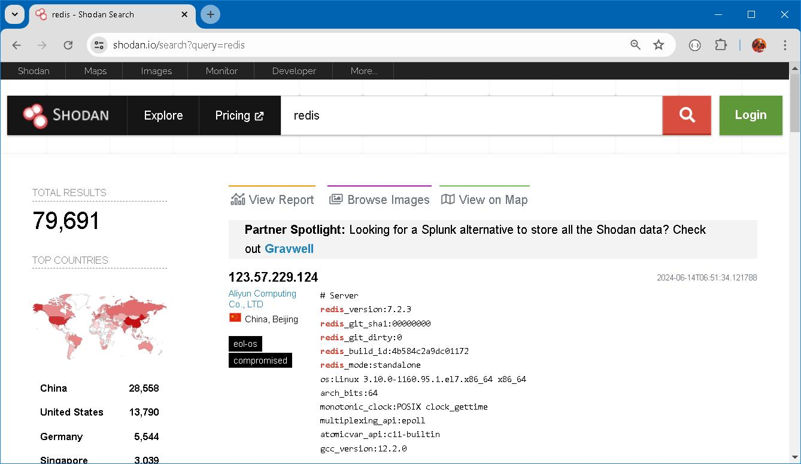

### On Security (cont.)


### Prologue 
This article is created from transscript of [RU330](https://redis.io/university/courses/ru330/) verbatim, not because of my laziness. But for the great significance and unstirrable value in the aforementioned narrative of the course. Nevertheless links and addenda will be appended whenever it is appropriate.

> "Every program and every privileged user of a system should operate using the least amount of privilege necessary to complete the job". -- Jerome Saltzer


### I. [Redis Horror Story #2](https://youtu.be/7VrOt4DETlo)
Before we start looking at ACLs, let's explore a use case for ACLs, and a reason why you should never run Redis as a sudo user. 

Here's a Redis horror story-- the Redis ransom. Imagine that you woke up and noticed your application was experiencing a complete outage. When you logged into your server both your database and web server were gone. All that was left was a smile file
named READ_TO_DECRYPT. In it was a link to the note that you see here.


This note claims that all your data has been encrypted. To get to the private key that will decrypt your files, you just need to send two Bitcoin to the provided Bitcoin wallet address. So you pay the ransom. What do you get in return? Nothing. Your data is lost forever, and you're two Bitcoin poorer which today is like $20,000. This is exactly what happened in the Crackit exploit of 2016.

According to [Duo Security](https://duo.com/decipher/over-18000-redis-instances-targeted-by-fake-ransomware), a cloud security vendor now owned by Cisco, over 18,000 Redis servers were affected. And we can assume that some undeserving attacker got a nice payday. This exploit affected Redis servers that were open to the internet and that either had no password, or a very weak password. Once the attackers had access to the Redis server, they ran a clever series of Redis commands that gave them access to the hosting server itself. Here's how it worked.

First they issued a `FLUSHALL` command to remove all the data from the Redis server. Next, they set a single Redis key to the value of an SSH key. 


And after that, they used a couple of Redis `CONFIG` commands to write their SSH key to the server which enabled them to log in as root. If you're not familiar with it, the Redis `CONFIG` command allows you to update most Redis configuration settings using any Redis client.

As you can imagine, this is rather dangerous. For this reason, Redis Enterprise completely disables this command. If you're running open source Redis, you should either disable this command or ensure that almost no one has privileges to run it. OK, so once an attacker had installed their SSH key, they could log into the server itself and delete whatever data they wanted. Here's the script they ran once they had access to the server. 


See how they delete web servers and data files? This attack easily could have been prevented with some of the basic security controls we learned last week: enabling authentication and not running Redis as root. But it turns out that you can do even better than this by using [Access Control Lists](https://redis.io/docs/latest/operate/oss_and_stack/management/security/acl/) and abiding by the principle of least privilege. For the rest of this week, we'll see just how that is done.


> Be sure to disable dangerous commands when they aren't needed, you never know how they will be used. 


### II. [ACL Concepts](https://youtu.be/GuWWmR4od-A)
[Access Control Lists](https://redis.io/docs/latest/operate/oss_and_stack/management/security/acl/), or ACLs for short, fundamentally change how Redis's authentication model works. Before Redis 6, Redis authentication was primitive. A single password secured your Redis deployment. There was no support for multiple users and passwords. And there was no support for per-user permissions either, what you might call authorization. 


Redis ACLs changed all of that. Now you can create multiple Redis users, each with their own password. And you can control each user's permissions. This is important because you can now effectively implement the *principle of least privilege*. Using ACLs to implement the principle of least privilege prevents a number of bad outcomes. For example, you wouldn't want a new administrator to accidentally drop your database. In this case, you create an ACL that prevents your new administrator from running the `FLUSHDB` or `FLUSHALL` commands.
```
ACL SETUSER newadminuser on >password -FLUSHDB -FLUSHALL 
```

Similarly, you wouldn't want an attacker with compromised credentials to be able to probe or steal data from your Redis database. If I were an attacker with compromised credentials, one of the first things I would do is run the `SCAN` or `KEYS` command to find out what keys were in the database. I'd then run the `TYPE` command to see which Redis commands I could run on each key. If I couldn't run the `SCAN` or `KEYS` commands, I'd be left guessing what key names to attack this database with. So as an administrator, I'd want to prevent most service account users from running the `SCAN`, `KEYS`, or `TYPE` commands, unless they're part of the application design, just in case those account credentials
ever got into the wrong hands. It could also help you to reduce the impact of careless user
mistakes.

In general, you should be giving users the least amount of privilege used to perform their job.You can do this by separating users by *role*. For example, a developer may only need read and write access, while an administrator may only need the ability to configure Redis. You may also want to separate applications by role. For example, some applications may only read from the database, and others may only write to the database. 


A good example of this is a Pub/Sub application. In a Pub/Sub pattern, you have a publisher and a subscriber. Your publishers will probably only need the ability to create data, while your subscribers will probably only need access to read from the channels they're subscribed to. Another way to implement the principle of least privilege is to restrict data based on key patterns using namespacing techniques.

For example, if you do not want an administrator to be able to access sensitive data, you can prefix all of the keys that are sensitive with the secret namespace. Imagine that you had an accounts table that contained user names, user details, and password hashes. You can namespace the keys for each user to be `secret:users` and only give access to the secret namespace to the service account for your application. 


Any restriction on keys should be considered carefully as they must be built into the design of your keys when implementing your applications. OK, so that's ACLs in a nutshell.

**Benefits of Access Control Lists**
- Command and Key Restrictions 
- Mitigate damge from a compromised username and password
- Reduce impact of mistakes 

In the next unit, we'll see how ACLs work in practice,
so stay tuned.


### III. [Practical ACLs with Redis](https://youtu.be/Va95q2SXGPA)
Onscreen, you can see three ACL commands.

FALCO
```
acl setuser falco on >butterscotch +@all -@dangerous -@admin +acl|whoami allkeys 
```

RICK
```
acl setuser rick on >pickle +@admin 
```

CACHESERVICE 
```
acl setuser cacheservice on >cacheme +set +get ~cache:*
```

By the end of this unit, you'll understand what these commands are doing and how you might use them as part of a database caching service. 

We've specified three users here: `Falco`, who's our software developer, `Rick`, our administrator, and `cacheservice`, which is for the application itself. We'll see what these commands do in a moment. 

But first, before we do anything, we need to disable the default user and set an admin user. The default user exists in every Redis deployment and has full permissions. Here's the command to disable the default user. 
```
acl setuser default off
```

Remember, always disable the default user when you're not using ACLs, but only after you add the administrative user of your own. *You should only use the default user when it's required for backwards compatibility with Redis 5 or below*. 

So now, let's look at `Falco`. 
```
acl setuser falco on >butterscotch allcommands -@dngerous -@admin +acl|whoami allkeys 
```

`Falco` is our development user. She needs database access to create and test her applications. We start with the ACL [SETUSER](https://redis.io/docs/latest/commands/acl-setuser/) command, followed by the user name, which in this case is `Falco`. We next specify "on" to indicate that the user can log in. After that, we specify the user's password: butterscotch. The greater than sign here indicates that this is a password. Next, we'll specify three rules that give `Falco` access to the full suite of Redis commands, except those that are in the dangerous category. *By default, ACL users have no permissions*. So we start by giving `Falco` permission for all commands, using the allcommands flag here. We then subtract the dangerous commands with the -@dangerous rule. We next explicitly grant access to the ACL WHOAMI command with the plus ACL pipe whoami. And finally, we specify allkeys, which allows `Falco` to access any key in the database. If we authenticate as `Falco`, you'll see that she has access to the ACL WHOAMI command, but not the ACL LIST command. `Falco` also can't run the KEYS command, because this is in the dangerous command category. And `Falco` can't run the CONFIG command, because this is an admin command. `Falco` can, however, SET and GET the key foo and run any other data structure commands. So `Falco` can do her job as a developer. Notice that in configuring `Falco`, we followed the principle of least privilege. She has access to the exact commands she needs and none that she doesn't. 

You might be wondering what commands the Redis ACL system considers dangerous. To check this or any ACL category rule, run the `ACL CAT` command. For example, here we'll run `ACL CAT DANGEROUS`. You'll see a list of commands that include KEYS and FLUSHDB to take a couple of examples. To see a list of all command categories, run `ACL CAT` with no arguments like this. 
```
> ACL CAT
1) "keyspace"
2) "read"
3) "write"
4) "set"
5) "sortedset"
6) "list"
7) "hash"
8) "string"
9) "bitmap"
10) "hyperloglog"
11) "geo"
12) "stream"
13) "pubsub"
14) "admin"
15) "fast"
16) "slow"
17) "blocking"
18) "dangerous"
19) "connection"
20) "transaction"
21) "scripting"
```

OK, so now let's configure our admin user, Rick. 
```
acl setuser rick on >pickle +@admin 
```

In this case, the ACL settings are pretty simple. We set our user, Rick, to on so that he can log in. We set his password to pickle, as indicated by the greater than sign. And finally, we specify +@admin, which gives Rick access to the admin commands. Now, let's log in as Rick. You can see, unlike `Falco`, Rick can run the CONFIG command to see how this Redis instance is configured. Rick can also run the ACL LIST command to see the users for this Redis database. Here again is the principle of least privilege. Rick's primary duty is to administer Redis. This includes adding users, using the ACL command, configuring Redis, and setting up the deployment model. It may also include helping to troubleshoot issues. Rick only has the access needed to do his job, to perform administrative functions. 

Our last user is for the application itself. It's also important to create specific users for your applications and to apply privileges accordingly. 
```
acl setuser cacheservice on >cacheme +set +get ~cache:*
```

Here, we create the cacheservice user. We set the user to on. Then, we provide a password. Now comes the permissions. The cache service can run two commands, SET and GET. We indicate that with the +SET and +GET rules, we also limit the queues that the cache service can touch. The rule ~cache:* restricts this user to the keys beginning with cache: . 

Let's log in as the cache service. If we try to set the key, `data:123`, we get a NOPERM error, saying that we don't have access to the given key. That's because we're limited to certain keys in the Redis key space. Let's try again with the key, `cache:123` In this case, the command succeeds. We also get the same key. Notice that we can't run any other commands as the cache user. If we do, we'll get a no permissions error. 

You should now have a basic idea about how to create users and ACLs. And you're probably already thinking about how you might assign your own administrative users, developers, and service accounts their respective ACLs. To learn more about Redis ACLs and get all of the details on the ACL rule syntax, we encourage you to check the Redis docs. 

> Before deployment, disable the default user and set an admin user. The default user exists in every Redis deployment and has full permissions, which is considered dangerous as an attacker will expect its presence as a way to access your data.


### IV. [Administering Redis ACLs](https://youtu.be/Q1rPFw6Iz64)
The best way to manage ACL users in Redis is to specify them in an ACL configuration file. If you have just a few users, you can configure them directly in the Redis conf config file. But for more complex ACL setups, you can and should write them to a separate configuration file.

> Use an external Redis ACL file to manage ACLs

In this unit, we're going to show you just how to do that. But before we move on, let me just do a quick shameless plug and say that if you have dozens of users and complex roles to configure, then you might want to check out Redis Enterprise Software or Redis Enterprise Cloud. Both of these products feature role based access control or RBAC for short. And that means that you can define generic roles and then assign those roles to your users. And all of this is done using a user friendly UI. So this will likely be more convenient if you're a bigger organization.

> Redis Enterprise & Redis Enterprise Clould come with role based access control to simplify provisioning ACLs. 

OK, back to our open source Redis. when you're configuring access control lists in a file, you want to start with the user directive, followed by the syntax used with the ACL SETUSER command. Let's see how we'd store the three users we created in the last unit. We're going to store this configuration in a file called `acl.conf`. We're referencing the file from a `redis.conf` file, as you can see here. So let's now open up `acf.conf`.

First, we disable the default user. 
```
user default off 
```

Next, we specify our three users: Falco, Rick, and cacheservice. 
```
user falco on #80e5b5a554cccea7aad01d910203bb6364d2ae4b4f321cd91841821913a8574a +@all -@dangerous -@admin +acl|whoami allkeys 

user rick on #6d08a4e630e4aa0d5cd873e65aea0a23df42de61073ecb49ef17158fe6a9dcea +@admin 

user cacheservice on #a9c5ed4cb5ff21ddf0d2125554aa94c5ab487803bb27eca081b925cde8473360 +set +get ~cache:*
```

Notice that each user declarative starts with the user directive. You'll also notice a long, encoded string beginning with a pound sign. This is the user's password hashed with the sha256 hash function. If you're going to store ACL configuration in a file, it's really important never to store the passwordsas plain text.

So here, we've hashed the passwords. The pound sign tells Redis that these passwords have been hashed with the sha256 hash algorithm. So how do you hash your passwords? You can run them through the Linux shasum utility like this. 
```
echo -n "pickle" | shasum -a 256
```

Here, I'm getting the shasum for the password: pickle. But it's probably easier to start up a Redis instance, configure your ACLs from the command line, and then call `ACL SAVE` so that Redis will write out the configurations to a file for you. To do this, all you need is a user who has access to the @admin cat command category or permissions the ACL command.

Let's use the command line to add a new user named Claude with the password: blueberry. Next, we'll call `ACL SAVE`. Now, if we open up our acl.conf file, we can see that Redis has written our ACL users alphabetically and in a fully normalized form. 
```
redis-cli 
AUTH rick pickle 
ACL SETUSER claude on >buleberry +@admin 
ACL SAVE 
EXIT
```


Here's the line with the user we just added. And notice that Redis writes out the hashed password for us. Once we've updated our ACL file locally, we need to get it into our Redis servers. We'll assume that you have a way of syncing configuration files to your production deployment. Once you've done that, issue an `ACL LOAD` command to each Redis server in your deployment. This will ensure a zero downtime update. Now, let's look at some commands you might run when you're administering ACLs from the Redis CLI.


First, I'll run an `ACL WHOAMI`. This command will show me which user I'm currently logged in as. Here you can see, I'm logged in as Rick. To see a list of all Redis database users, run the `ACL LIST` command. Notice the default user is off and has access to no commands. You'll also see other users we've provisioned. We can also use the `ACL CAT` command to explore command categories. So here are all the categories. And as I said in the last unit, you can also use the ACL CAT command to see which commands each category includes. So here's what's included in the scripting commands category. 
```
ACL CAT scripting 
```

OK, finally to delete a user, run the` ACL DELUSER` command. This is the sort of ACL modification you might need to make in production in the event of some kind of emergency. Just be sure that any change you make here also gets written back to your ACL configuration files. At this point, you should have all the basic knowledge needed to start using ACLs with your own Redis deployments. There are a few more details in the Redis ACL docs, which you should explore at your leisure. We'll link to those docs in the course handout.

Finally, for complex ACL setups that require role based access control, you should check out Redis Enterprise Cloud or Redis Enterprise Software. These products can really simplify the management of users and rules. OK, end of shameless plug. See you after the security tips.


> The best way to manage ACL users in Redis is to specify them in an ACL configuration file. If you have just a few users, you can configure them directly in the redis.conf configuration file. For large and complex ACL setups, you can and should write them to a separate configuration file.


### V. Dangerous Commands
You probably noticed that Redis has an entire ACL category dedicated to dangerous commands.

So what are dangerous commands, and why are they dangerous?

Dangerous commands include administrative commands and other commands that may negatively affect database performance or render your database unavailable.

As a general rule, you should avoid running dangerous commands in production.

#### Administrative commands
You should consider most admin commands dangerous, as you want to prevent these commands from being run by an attacker at all costs.

For example, the `CONFIG` command is an administrative command that allows you to modify the Redis configuration at runtime. Changing the configuration could disrupt applications and cause outages. `CONFIG` should only be used in production by those who understand what they are doing and only when absolutely required.

On the other hand, the `LASTSAVE` command is also an admin command and is therefore marked as dangerous. This command gives you the timestamp of the last successful write to disk. It's highly unlikely that this command could be used to damage Redis in any way.

#### Dangerous commands may impact performance
Commands that may significantly impact performance are dangerous. If you're an experienced Redis user, you probably know to avoid the `KEYS` command. The `KEYS` command scans all keys stored in the Redis server and blocks until it completes. This can take anywhere from several seconds to several minutes depending on the number of keys on the server, which means that this command can block other clients for quite some time. For this reason, KEYS is considered dangerous.

#### Dangerous commands may impact availability
The final category of dangerous commands may impact the availability of your Redis database. For instance, the `FLUSHDB` and `FLUSHALL` commands will delete all of the data in your database. Likewise, the `SHUTDOWN` command will terminate the Redis process. Obviously, running this command on a production database will affect your applications negatively.


### VI. [Basic Redis Security](https://youtu.be/BoZOZhDnxtI)
Now that we've installed Redis securely, it's time to learn about the most basic Redis security settings. In this unit, we'll be discussing firewalling Redis, Redis' protected mode, and the default bind interface in the Redis configuration file. In the next unit, we'll discuss authentication. 

These are the most basic Redis security controls typically used with Redis. I strongly recommend that you run Redis behind a firewall and use authentication at all times in production. If you don't, you'll greatly increase the risk of a data compromise. Let's start with [firewalling](https://en.wikipedia.org/wiki/Firewall_(computing)). 

> In computing, a firewall is a network security system that monitors and controls incoming and outgoing network traffic based on predetermined security rules.

Firewalling is the process of subdividing your network for improved security. Remember Redis Wannamine? This isn't the only attack targeting Redis. Here is an [article](https://www.imperva.com/blog/archive/new-research-shows-75-of-open-redis-servers-infected/) about another crypto mining campaign targeting Redis instances that happened to be open on the public internet. The number one rule for Redis, or any database for that matter, is to never allow a production deployment to be open on the public internet. 


This means setting up a firewall and ensuring that your database is behind it with no exposed Redis ports. You should always deploy your database in a private network and connect to it using private IP addresses. If you're hosting Redis on your favorite public cloud, you typically deploy Redis in a virtual private network, which is better known as a VPC or VNet. If you're hosting Redis on-premises in a data center, you need to make sure that Redis is not hosted inside your demilitarized zone, that is your DMZ, and that you use a firewall to block access to Redis.

This advice might seem obvious, but in reality, there are a lot of folks that still expose their database to the public internet. We can see some of these at [Shodan.io](https://www.shodan.io/), which is basically a search engine for public internet servers. Companies often use Shodan to monitor their networks, but the bad guys can use this tool just as easily. Let's type Redis into the search bar. Here, you can see a list of Redis servers open to the entire internet.



It would be trivial to connect to any of these servers. And yes, we've blurred the IP addresses for their protection. But you can see a full listing of information for each Redis server, everything from the server version to the compiler version. We can also see that some servers have no authentication enabled. If I wanted to hack this server, I've just hit the jackpot. If you scroll down in Shodan a bit, you'll see that other Redis servers don't share this information. That's because they're running in protected mode. 


So what is protected mode? Protected mode helps us prevent new Redis deployments from being exposed to the world or even to your internal network. When Redis starts with the default configuration, it's automatically started in protected mode. In this mode, Redis will only reply to clients located on the same server that Redis is running on. If you connect from a remote host and try to run a command, you'll get an error message as you see here. So you have to disable protected mode to access Redis outside of the local host.So how do you disable protected mode? Typically, through the Redis conf file. You simply have to set protected mode to no here. 


The Redis conf file also comes with a default directive to bind exclusively to the local network interface. This means that Redis will only listen to connections coming to this specific IP address, which is, by default, the local loopback interface. To have Redis listen on all network interfaces, just comment out the bind directive. Or if you want to bind to a specific interface, provide that interface's IP address to the bind directive. 


To review, don't ever expose your Redis server to the public internet. Ensure that you're firewalling and binding to the correct network interface, and be sure to disable protected mode only when you've secured your server with the network and, ideally, after you've enabled authentication. In the next unit, we'll get a basic introduction to authentication in Redis.


### VII. [Basic Authentication](https://youtu.be/B4jxDMxVvYM)
Now, let's talk about basic authentication. Using Redis without authentication is one of the worst Redis deployment practices we see in the wild. To run Redis securely, you really need to enable auth. There are two ways to do this. Prior to Redis 6, there was no concept of users. You simply set a single global password that controlled all access to the Redis server. In the Redis conf file, you can set this global password with the `requirepass` directive. Here, I'm setting the password to imadolphin. 


Now I'll restart Redis with the new config. Now, when I connect to Redis, I can't run any commands until I authenticate with this password. See? Here, I'm trying to run the `info` command, but I get a noauth authentication error. Now I'm going to authenticate by running the `auth` command and providing the configured password. If you're using a version of Redis before Redis 6, then this is your only option for enabling authentication. This `requirepass` directive still works in Redis 6 for backwards compatibility. But if you're running Redis 6 or later, then you should definitely use the `ACL` user directive instead. In Redis 6, there's now a default user called `default`. You need to make sure that this default user has a password since it won't have one to begin with. So I'm going to open up the Redis conf file and comment out the `requirepass` directive. Now, I'm setting the default user's password to imadolphin. I'm also giving this user all permissions to the database. This configuration is now equivalent to what we had with the `requirepass` directive before.


Now I'll restart Redis with this new config. Now, when I log in, I need to authenticate as this default
user before I can do anything. I use the same `auth` command to authenticate, but I also provide the user name, as you see here. Now I can run commands.
```
AUTH default imadolphin

INFO
```

A couple notes on passwords-- 
- first, you probably don't want to store plaintext passwords in the Redis conf file. We'll see how to store hash passwords here later in the course. 
- Second, you want to make sure that passwords can't be cracked through brute force. 

A password like imadolphin is probably too short for production. I recommend that you use a long, 128-character password, which would be practically impossible for an attacker to crack. How can you create such a long password? You can do this with Linux's shasum command. Here, I'm piping the password, imadolphin, to the shasum utility that comes with OS X. By specifying a 512-bit hash, I can create a password that's exactly 128 characters long. 


So what I've just described is the most basic form of Redis authentication. In this case, there's only a single user and password for all people and services accessing Redis. It's a much better practice to use finer-grained per-user access control. Redis supports these with ACLs or Access Control Lists, and we'll discuss these next week.


### VIII. [Securing Redis Client Code](https://youtu.be/JquRVRKYTxk)
In this unit, we're going to cover common techniques for securing the client-side code that interacts with Redis. But first, some good news. One of the most well-known security exploits in the database world is [SQL injection](https://en.wikipedia.org/wiki/SQL_injection). Because Redis doesn't use a query language, malicious injection isn't a real concern with Redis, so don't worry about SQL injection.

What you do need to worry about is validating any input that's used to run commands against Redis. This is relevant when constructing Redis key names and running Lua scripts.

Let's first look at key names. It's quite common in Redis to dynamically generate key names. Usually, you have a key naming pattern where you separate a different part of a key with a colon. For instance, if I'm storing user sessions in Redis, my keys might look like this. I'd start with a session to indicate the type of key, plus a colon, plus user to indicate the type of session, plus an ID representing that user. 


If I had separate session keys for, say, an API, those keys might look like this. 


Now let's look at a real-world example where unvalidated input might result in a user getting access to a key they shouldn't have access to. Suppose you run an e-commerce site that offers discounts for special promotions on your products. You have two API endpoints, one that gets the full product price and one that gets the value of the discount. The key for the price on the product you're purchasing is product colon 1234 while the key for the discount is product 1234 discount. The full price of the product is $200 while the discount gives you $100 off. Now, suppose your price API takes a product ID as one of its parameters. So a normal input would be 1234, and that would resolve internally to the key product 1234. See where I'm going with this? What if the attacker provided an ID of 1234 colon discount? Without any validation, this will resolve to the key product 1234 discount. That's a big problem because the value stored in that key is negative 100. Great deal, right?


The company owes you $100 just for ordering their product. While it may be great as a customer, it's terrible if you're an e-commerce company. That's why, when you design applications that will be constructing keys with untrusted data, you need to validate the input data. In this case, we need to make sure that the input consists of a series of digits and nothing more, no colons or other characters allowed. If the input doesn't validate, we'll send the user a 404 instead of giving them a $100 refund. 

OK. So in addition to validating any input that's used to construct keys, you also need to be a little careful with [Lua](https://redis.io/docs/latest/develop/interact/programmability/eval-intro/) scripts. You may remember that Redis embeds a Lua interpreter so that you can write scripts in Redis for more complex business logic. If you're not familiar with Lua scripting in Redis, see [RU101](https://redis.io/university/courses/ru101/) intro course. Anyway, it should go without saying that you should never accept a Redis Lua script as a user input. Similarly, you should never dynamically construct a Redis Lua script from user input. As long as you're never constructing Lua scripts from your user input, you should be safe from any kind of Lua script injection.

So to recap, SQL injection is not a problem in Redis because Redis doesn't use a query language, let alone SQL. If you're dynamically constructing keys based on user input, then validate that input. And finally, Lua scripts can provide an injection attack vector if you construct them based on user input, so just don't do that. Lua scripts should always be written by your own developers.


### IX. [Disaster Recovery and Availability](https://youtu.be/n8YOQwUwq2g)
It's time for our first security tip of the week. If you read about the CIA triad in the reading I gave you earlier, then you should remember the A for availability. Availability is the property that the services you need are available for use when you need them. So if you're concerned about Redis security, you need to be thinking about what might cause your Redis servers to fail and how to get them running again in the event of a failure. Failure doesn't always happen. But when it does, you want to have a plan for recovering from it. There are three ways to recover from a failure event-- persistence, replication, and backups. 

- Persistence is how Redis stores data and moves it from memory to disk for use in the event of a reboot or service restart. 

- Replication is the movement of data to one instance of Redis from another, usually on another server. 

- Backups are cold copies of your data stored in a secure location. 

You should understand the choices associated with configuring both persistence and replication in order to feed into your disaster recovery and availability strategy. 

Let's first discuss persistence. Redis uses two files for persistence-- `RDB files` and `append-only files`, otherwise known as `AOF` files. RDB files provide point-in-time snapshots of the data stored within Redis. AOF files provide a more durable form of persistence that writes data as it's written to Redis continuously. A reading on persistence in detail will be provided following this video to help you understand the various levels of persistence associated with AOF and RDB files. Persistence shouldn't be your only backup and recovery strategy though. It will only help in a small subset of failure events. 

Replication through a Redis cluster is also a great recovery strategy. By deploying Redis in a cluster that uses replication, you can easily failover from one node or shard to another in the event that one fails. To deploy a higher availability cluster, you need to set up Redis in a cluster mode and use `Sentinel`. This will help Redis stay available in the event of a failure resulting in a cluster partition. Sentinel will help you deploy a highly available cluster by introducing *failure monitoring*, *failure notification*, and *automated failover*. If you don't want to implement a clustering strategy alone, that's OK. Redis Enterprise, the commercial offering for Redis offered by Redis Labs, implements an automatic clustering and sharding strategy for you while allowing you to use Redis as if it was running as a standalone server. Redis Enterprise also supports *active-active replication*. Active-active replication allows you to read and write from databases within geographically distributed clusters with strong eventual consistency. This allows you to achieve geographically separated high availability. 

Your security tip of the week is to remember that availability is part of the CIA triad, and to always consider persistence, availability, and disaster recovery in any security strategy.


### X. Configuring Redis
When it comes to RDB files there are two important concepts to know: save types and save frequencies.

There are two save types within Redis: `BGSAVE` and `SAVE`.

The `BGSAVE` command can be executed in the background and does not disrupt the processing of data within Redis.

On the other hand, The `SAVE` command, will block any other command from executing within Redis. Typically `BGSAVE` should be used and is the default within Redis configuration.

You can also set a save policy within Redis. Save policies are defined by the number of changes that occur within a given timeframe. If this threshold is met then Redis will automatically perform a backup.

To define a save policy you need to define the number of changes that can occur within Redis within any given timeframe. If this threshold is met, you will automatically perform a background save.

#### Save Configurations
Let's demonstrate some save configurations.

As we’ve said before, every Redis configuration should use the `redis.conf` file in production. All of these configurations are available within the `redis.conf` with the exact same directive names. Modern devops practices configure these with code.

However, to demonstrate these configurations we’ll be using the config command throughout this course.

Let's get started in the terminal.

You can set the filename by setting the `dbfilename`.
```
> config set dbfilename rdb.rdb
```
And then the directory by setting the `dir`.
```
> config set dir /var/lib/redis
```
Lastly, we need to define a save policy.
```
> config set save "900 1 300 10 60 1000"
```

You can have multiple save policies. Simply define the thresholds for time and changes that meet your data loss tolerance. You can define multiple thresholds to meet your requirements. In this example, a snapshot will be taken if one key is changed every 900 seconds, if 10 keys are changed within 300 seconds or if 1000 keys are changed within 60 seconds.

Your persistence file will load from the locations that you have defined here, or within your `redis.conf` file using the same directive.

#### Append-only Files
With Append only files there are two important concepts to understand, setting your `fsync` policy and setting your rewrite policy.

Lets first discuss `fsync`.

The function, `fsync` is the function responsible for writing data from memory to disk within Redis. You can configure how redis writes to disk in order to most effectively make tradeoffs between performance and durability for your use case. Redis supports three `fsync` policies, `always`, `everysec` and `no`.

With the policy **appendfsync always** Redis will wait for the write and the fsync to complete prior to sending an acknowledgement to the client that the data has written. This introduces the performance overhead of the fsync in addition to the execution of the command. The fsync policy always favors durability over performance and should be used when there is a high cost for data loss.

With the policy **appendfsync everysec** Redis will fsync any newly written data every second. This policy balances performance and durability and should be used when minimal data loss is acceptable in the event of a failure. This is the default Redis policy. This policy could result in between 1 and 2 seconds worth of data loss but on average this will be closer to one second.

Finally the policy **appendfsync no** is the last supported fsync policy. This policy favors performance over durability and will provide some, although minimal performance enhancements over fsync everysec at the cost of additional durability. You should only use this when everysec is too detrimental to performance for your taste, and you can afford the cost of additional data loss.

**An important exception to this policy is for clients using pipelining. When you pipeline with writes, you accept the potential for data loss for a maximum performance benefit because your client will not wait for a reply when pipelining.**

**You shouldn’t use an `fsync always` policy while pipelining writes because this will decrease your database performance without guaranteeing the durability you expect.**

You can also set how frequently you want this file to be re-written. This can help prevent the append only file from becoming too big, and improve the speed at which you can recover from a failure. *A rewrite is achieved by reading data in memory to create a new file so that the shortest AOF file is able to always be used.* You can set the percentage increase in size or the size increase of your AOF files as the trigger for a rewrite.

This is important to set to prevent your AOF file from filling your entire disk and to prevent startups from being too cumbersome.

The append only file can be found in the same working directory that we set earlier for our RDB file.

Like RDB, AOF files can be configured using the config command or the `redis.conf`.

It's always best to configure these in the `redis.conf` file since some configurations are not supported using the config command.

Lets turn on appendonly files using config in the command line.

First turn on `appendonly` mode by setting it to `yes`. **Append-only is turned off by default**.
```
> config set appendonly yes
```
Then you set the policy for `fsync`. We’re going to set this one to `always` because our application has a low data loss tolerance.
```
> config set appendfsync always
```

Next, we’ll define our rewrite policy.
```
# Automatic rewrite of the append only file.
# Redis is able to automatically rewrite the log file implicitly calling
# BGREWRITEAOF when the AOF log size grows by the specified percentage.
#
# This is how it works: Redis remembers the size of the AOF file after the
# latest rewrite (if no rewrite has happened since the restart, the size of
# the AOF at startup is used).
#
# This base size is compared to the current size. If the current size is
# bigger than the specified percentage, the rewrite is triggered. Also
# you need to specify a minimal size for the AOF file to be rewritten, this
# is useful to avoid rewriting the AOF file even if the percentage increase
# is reached but it is still pretty small.
#
# Specify a percentage of zero in order to disable the automatic AOF
# rewrite feature.

auto-aof-rewrite-percentage 100
auto-aof-rewrite-min-size 64mb
```

The rewrite policy here will rewrite after the aof file is 100 percent larger than it was during the last rewrite:
```
> config set auto-aof-rewrite-percentage 100
```

This could be an issue if our database is already huge though. What if it has massive turnover for a small subset of its keys. To fix this, we’ll also set a minimum size for the rewrite.

We’ll set ours here to 64 megabytes:
```
> config set auto-aof-rewrite-min-size 64mb
```

There are two important options you should be aware of when it comes to configuration of durability for AOF. Rewrite `fsync` handling and persistence with both the AOF and the RDB files.

First let's look at how to handle fsync on AOF file rewrites.

If you have extreme latency sensitivity and can accept some data loss, a configuration you may want to consider is `no-appendfsync-on-rewrite`.

This will block Redis from calling `fsync` while performing a save, which will enhance performance. This generally is not recommended unless you are able to accept the risk of some data loss during this time and have extreme performance requirements.

Finally, you need to consider that recovery speeds can be improved by using both aof and RDB files to recover data. You can set aof files to use the rdb file as a preamble to improve recovery speed:

#### Log Rotation
Log rotation helps you to ensure that the logs on your operating system don’t fill up disk space, which could result in an application issue if the disks are not partitioned separately. Also, it helps you to ensure that your Redis logs do not grow unnecessarily large.

While it depends on your distribution, log rotation is typically found in `/etc/logrotate.conf`. If you configure your Redis logs to be archived or sent to an external log server, log rotation is a prudent way to protect availability while ensuring that your server logs are still auditable. Consider log rotation and external logging strategies for all Redis logs. An example of Redis log rotation can be found at [Stack Overflow](https://stackoverflow.com/questions/5496014/redis-logrotate-config#5564481).

This will probably suffice:
```
/var/log/redis/*.log {
       weekly
       rotate 10
       copytruncate
       delaycompress
       compress
       notifempty
       missingok
```


### XI. Biblipgraphy 
1. [OVER 18,000 REDIS INSTANCES TARGETED BY FAKE RANSOMWARE](https://duo.com/decipher/over-18000-redis-instances-targeted-by-fake-ransomware)
2. [The 2019 Cost of a Data Breach](https://securityintelligence.com/posts/whats-new-in-the-2019-cost-of-a-data-breach-report/)
3. [Redis configuration file example](https://redis.io/docs/latest/operate/oss_and_stack/management/config-file/)
4. [The murder of Roger Ackroyd by Agatha Christie](https://www.gutenberg.org/ebooks/69087)

[ACL](https://redis.io/docs/latest/operate/oss_and_stack/management/security/acl/)


### Epilogue 
> a man may work towards a certain object, may labour and toil to attain a certain kind of leisure and occupation, and then find that, after all, he yearns for the old busy days, and the old occupations that he thought himself so glad to leave?


### EOF (2024/06/17)
